# BIG_DATA_HDFS
## HDFS
HDFS, or Hadoop Distributed File System, is a distributed file system designed to store and manage very large datasets in a distributed computing environment. It is a key component of the Apache Hadoop ecosystem, which is used for processing and analyzing big data.

## BIG DATA

Big data refers to extremely large and complex data sets that are difficult to manage, process, and analyze using traditional data processing tools and methods. The term "big data" encompasses not only the sheer volume of data but also its variety, value, velocity, and veracity.

## Start Hadoop processes
## Start HDFS service and YARN service
Start the HDFS services and YARN services with the following commands:

`start-dfs.sh`

`start-yarn.sh`

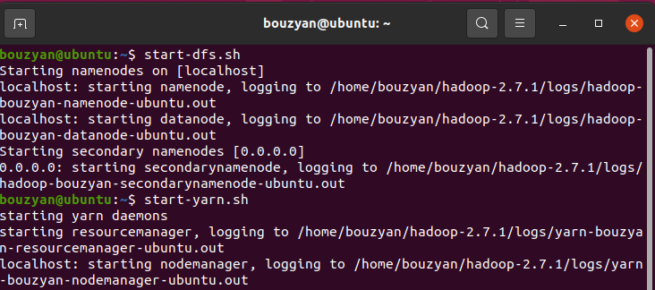

## Check if the services have been started

`jps`

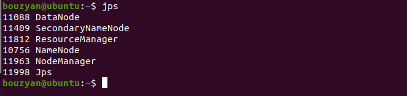

## Open the web interface for the NameNode

`http://localhost:50070`

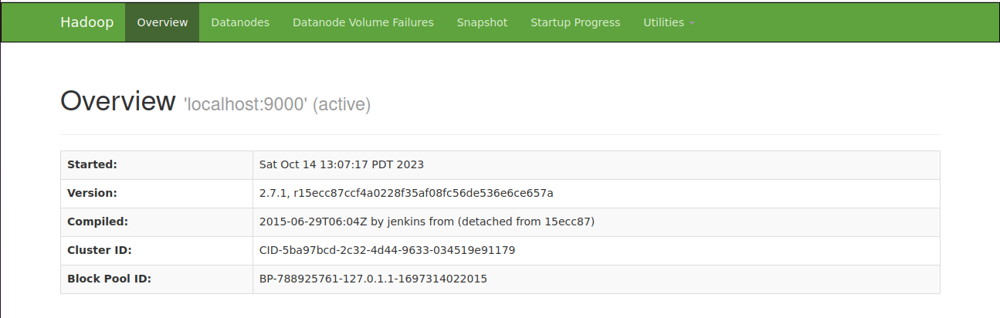

## Formulate the tree structure below in HDFS

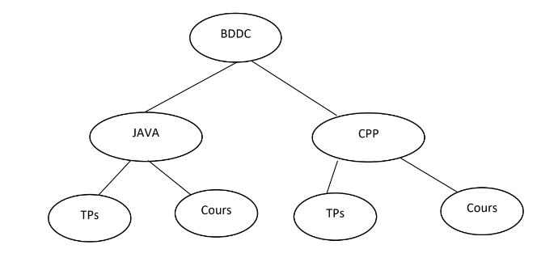

`hdfs dfs -mkdir -p SDIA/{JAVA/{TPs,Cours},PYTHON/{TPs,Cours}}`

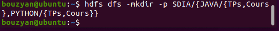

## Generate files within a directory 

`hdfs dfs -touchz SDIA/PYTHON/Cours/{CoursPY1,CoursPY2,CoursPY3}`

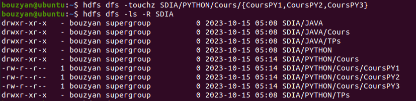

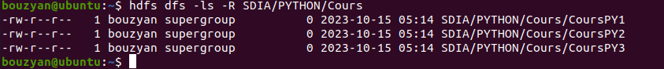


## Add content to files and then view the file contents

`echo "Master SDIA!" | hadoop fs -appendToFile - SDIA/PYTHON/Cours/CoursPY1`

`hdfs dfs -cat SDIA/PYTHON/Cours/CoursPY1`

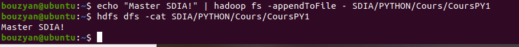

## Transfer files to a different repository

`hdfs dfs -cp -f SDIA/PYTHON/Cours/{CoursPY1,CoursPY2,CoursPY3} SDIA/JAVA/Cours`

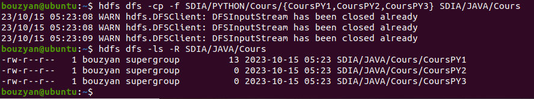

## Delete a file

`hdfs dfs -rm SDIA/JAVA/Cours/CoursPY2`

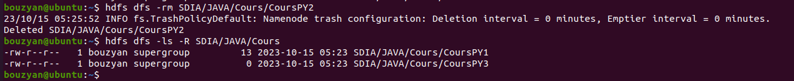

## Rename files

`hdfs dfs -mv SDIA/JAVA/Cours/CoursPY1 SDIA/JAVA/Cours/CoursJAVA1`

`hdfs dfs -mv SDIA/JAVA/Cours/CoursPY3 SDIA/JAVA/Cours/CoursJAVA2`


## Create file in local 

`touch {TP1CPP,TP2CPP,TP1JAVA,TP2JAVA,TP3JAVA}`

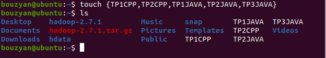

## Transfer files from a local source to HDFS

`hdfs dfs -copyFromLocal {TP1CPP,TP2CPP} SDIA/PYTHON/TPs`

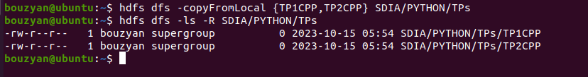

## Show the contents of the repository

`hdfs dfs -ls -R SDIA`

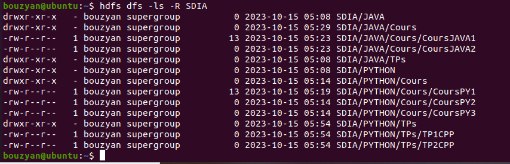


## Delete file and directory

`hdfs dfs -rm SDIA/PYTHON/TPs/TP3CPP`

`hdfs dfs -rmr SDIA/JAVA`

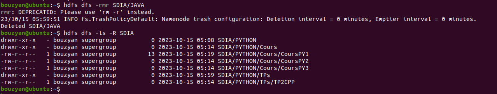

## Hadoop FileSystem API
The following example demonstrates how to perform a write operation to a text file in HDFS:
```java
public class MyJavaClass {
    public static void main(String[] args) {
        // Your Java code here
    }
}


